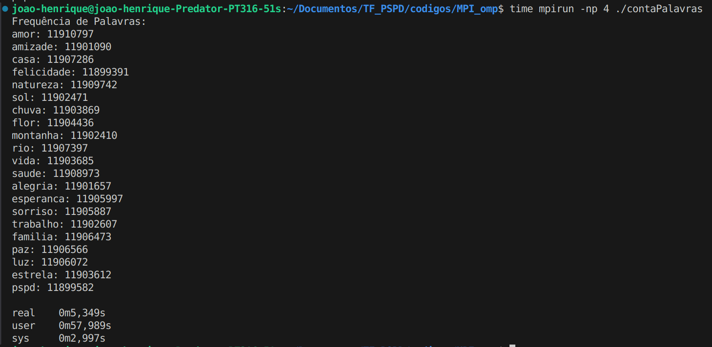
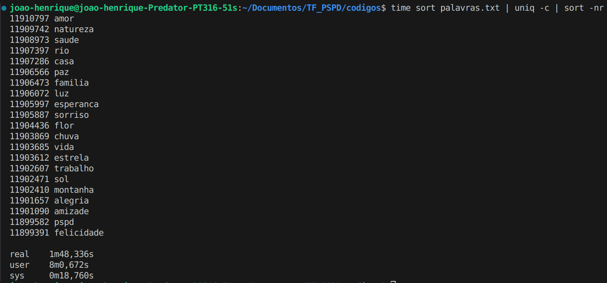

# Trabalho final PSPD

## Integrantes
|Matrícula | Aluno |
| -- | -- |
| 190084600  |  Arthur José Nascimento de Lima |
| 202023681  |  Gabriel da Silva Rosa |
| 200019015  |  Guilherme Puida Moreira |
| 200067923  |  João Henrique Marques Calzavara |
| 200062379  |  Marcos Vinícius de Deus |

## Geração do arquivo palavras.txt

&emsp;&emsp;Para gerar o arquivo que posteriormente será analisado pelos códigos de contagem de palavras, após ter feito a clonagem do repositório, entre na pasta [codigos](./codigos/), e execute o arquivo [gerar_palavras.c](./codigos/gerar_palavras.c) com os seguintes comandos.

```
gcc -fopenmp -o gerar_palavras gerar_palavras.c
./gerar_palavras
```

&emsp;&emsp;Após isso, o arquivo palavras.txt com 250 milhões de palavras será gerado. (É necessário possuir ao menos 2.7GB de armazenamento livre).

## Código MPI/OMP

&emsp;&emsp;Para executar o código MPI/OMP localmente deve estar na pasta [MPI_omp](./codigos/MPI_omp/) e executar os seguintes comandos no código [conta_palavras.c](./codigos/MPI_omp/contaPalavras.c), deve se utilizar os seguintes comandos (utilizamos o **time** para verificar o tempo, e 4 processos para o **MPI** nesse caso).

```
mpicc -fopenmp -o contaPalavras contaPalavras.c
time mpirun -np 4 ./contaPalavras
```
### Resultado local sem cluster



&emsp;&emsp;Para averiguação do resultado do código rodamos o seguinte comando abaixo estando na pasta [codigos](./codigos/), que nos mostra que os resultados foram os mesmos, porém com um tempo bem maior que usando **MPI/omp**.

```
sort palavras.txt | uniq -c | sort -nr
```


